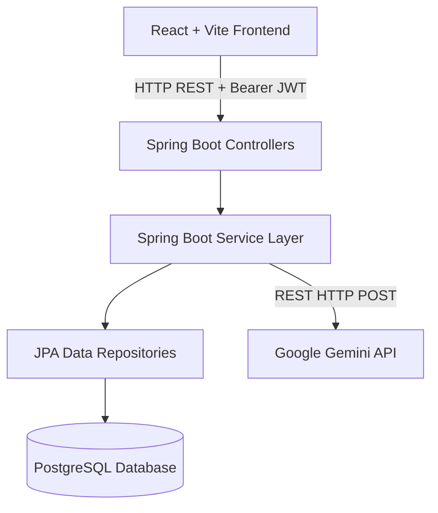

# TaskFlow — AI-Powered Task Management Portal

TaskFlow is a premium, full-stack task management portal featuring interactive Kanban boards, search and filter grids, secure JWT-based user authentication, and advanced AI integration.

Leveraging the **Google Gemini API**, TaskFlow allows users to input a simple task title and automatically generate structured, markdown-compatible task descriptions, suggested priority badges, and estimated completion times.

---

## 🏗️ Architecture Overview

The system is built as a decoupled Client-Server architecture:



### Backend (Java Spring Boot)
Adheres to a clean, decoupled layered architecture:
- **`model/`**: JPA Entities (`User`, `Task`) mapping to PostgreSQL tables.
- **`repository/`**: Interfaces extending `JpaRepository` for database query actions.
- **`service/`**: Core business domain logic, database transaction demarcation (`@Transactional`), and external API calls (`GeminiService` calling Google Gemini).
- **`controller/`**: REST API exposure, routing, and controller-level request verification (`@Valid`).
- **`config/`**: Interceptor configuration (`JwtAuthenticationFilter`), authentication utilities (`JwtService`), and HTTP configuration rules (`SecurityConfig` with CORS parameters).

### Frontend (React + Vite + Tailwind CSS)
Modular component-based UI:
- **State Management**: Built on React Context (`AuthContext`) to manage user details, load states, and cache tokens.
- **Services**: Custom instance configuration of Axios (`api.js`) appending Bearer tokens to request headers.
- **UI & Layout**: Fluid Glassmorphism design system tailored with CSS animations and responsive views (Kanban Board Columns vs. Grid List).

---

## 🛠️ Tech Stack & Requirements

- **Backend**: Spring Boot 3.3.0, Java 17+, Maven 3.x
- **Frontend**: React 18, Vite, Tailwind CSS 3.x, Lucide React
- **Database**: PostgreSQL (e.g., local database or Neon cloud instances)
- **AI Service**: Google Gemini API (`gemini-1.5-flash`)

---

## 🚀 Getting Started

### 1. Database Setup
Ensure you have a PostgreSQL database running. Import the schema script located at:
* [`backend/src/main/resources/schema.sql`](file:///Users/vyomverma/Desktop/TASKTODO/backend/src/main/resources/schema.sql)

Alternatively, Spring Boot is pre-configured to automatically generate/update the database tables on startup.

### 2. Configure Environment Variables
Copy `sample.env` to a `.env` file at the project root and fill in your secrets:
```bash
cp sample.env .env
```
Key variables to update:
- `DATABASE_URL`: JDBC connection string (e.g. `jdbc:postgresql://ep-your-neon-url.neon.tech/taskflow?sslmode=require`)
- `DATABASE_USER` & `DATABASE_PASSWORD`
- `GEMINI_API_KEY`: Get your free key from [Google AI Studio](https://aistudio.google.com/)

### 3. Run Backend (Spring Boot)
Navigate to the backend directory, verify configurations, and compile/boot the app:
```bash
cd backend
# Compile and run via maven wrapper or your local maven setup
mvn spring-boot:run
```
The REST API will launch at `http://localhost:8080`.

### 4. Run Frontend (React + Vite)
Open a new terminal window, navigate to the frontend directory, and start the development server:
```bash
cd frontend
npm install
npm run dev
```
The client portal will launch at `http://localhost:5173`.

---

## 🛡️ API Endpoints

### Authentication Module (Public)
* `POST /api/auth/register` — Create a user account and receive an auth token.
* `POST /api/auth/login` — Sign in with credentials and receive an auth token.

### Task Management Module (Protected - Requires JWT Authorization Header)
* `GET /api/tasks` — List all tasks associated with the authenticated user.
* `GET /api/tasks/{id}` — Fetch details of a specific task.
* `POST /api/tasks` — Create a new task.
* `PUT /api/tasks/{id}` — Update details or change status of a task.
* `DELETE /api/tasks/{id}` — Delete a task.

### AI Assist Module (Protected - Requires JWT Authorization Header)
* `POST /api/ai/generate` — Generate task description, suggested priority, and estimated completion effort.
  * **Payload Request**: `{ "title": "Implement JWT Middleware" }`

---

## 🤖 Gemini API AI Integration

When clicking **AI Auto-Fill** in the task form, the client submits the Task Title to the `/api/ai/generate` endpoint.

### Prompt Framework
The backend sends a prompt to `gemini-1.5-flash` asking for three specific metrics:
1. A markdown description summarizing task objectives, action items, and criteria.
2. A priority rank (restricted to `LOW`, `MEDIUM`, or `HIGH`).
3. An estimated time frame (e.g., `3 hours`, `2 days`).

We configure Gemini's `generationConfig` parameter with `"responseMimeType": "application/json"` to guarantee structured JSON output.

### Robust Exception Fallback
If the Gemini API fails (due to rate-limiting, internet outages, or invalid API keys), the `GeminiService` intercepts the exception and builds a fallback response dynamically based on the title keywords, ensuring zero disruption to the user's workflow:
- **Title Keyword Detection**: Searches for keywords like *critical*, *bug*, *fix*, *low* to assign sensible default priorities.
- **Dynamic Boilerplate**: Sets standard markdown checkboxes and action parameters based on the title.

---

## 🌐 Deployment Configuration

### Database (Neon PostgreSQL)
1. Set up a free serverless PostgreSQL instance on [Neon](https://neon.tech/).
2. Grab the connection URL and add it to your environment variables.

### Backend (Render)
1. Connect your Git Repository to [Render](https://render.com/).
2. Create a new **Web Service** and choose the **Docker** or **Java** runtime environment.
3. If using Java:
   - Build Command: `mvn clean package -DskipTests`
   - Start Command: `java -jar target/taskflow-0.0.1-SNAPSHOT.jar`
4. In the **Environment** settings page, add the credentials (`DATABASE_URL`, `DATABASE_USER`, `DATABASE_PASSWORD`, `JWT_SECRET`, `GEMINI_API_KEY`).

### Frontend (Vercel)
1. Connect your repository to [Vercel](https://vercel.com/).
2. Create a new project and select the `frontend` folder as the root directory.
3. Select the **Vite** configuration framework.
4. Set the **Environment Variable** `VITE_API_URL` to point to your deployed Render URL (e.g. `https://taskflow-api.onrender.com/api`).
5. Click **Deploy**.
